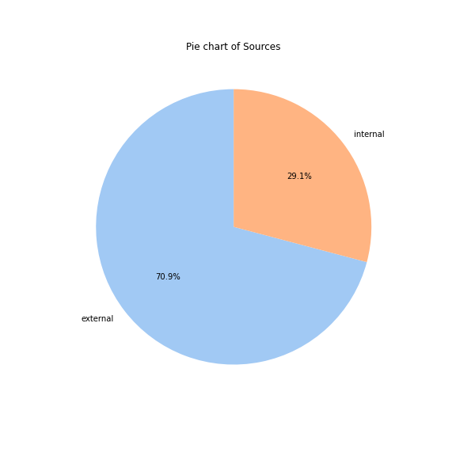

# ADS Project 1: Happiness Source: External or Internal  
### Doc folder

**Files in this folder:**
Text_Processing.Rmd: preprocessing data and generate processed_moments.csv   
Analysis.ipynb: analysis data and present the data story   

**How to replicate:**
Step1: Run Text_Processing.Rmd   
Steps2: Run codes in Analysis.ipynb   

## Report  
This project aims to analysis the sources where people gain happiness from, which is inspired by the popular MBTI personality test. In the MBTI test, we would find out how our attitudes would be, i.e. Introversion or Extraversion. Introvert people seek energy inwards, and outrovert people receive energy outwards. This difference has inspired me to inspect happiness experience from the perspective of source. To be specific, this project will address the following questions:   
1. Do people more likely to gain happniess from external sources or internal sources?  
2. How do the scources people gain happiness from differ with gender/age/marital/parenthood status as well as reflection period?  
3. What's the practical values of the findings?  

### Q1: do people more likely to gain happniess from external sources or internal sources?
#### Step 1 : Indentify happiness sources
We first need to identify the happiness sources mentioned in the text. Here, internal sources are defined as those without a second party (human beings, pets etc.) involved, while sources related to nature are viewed as internal (since nature is passive in the experience). And external sources are therefore the opposite. The strategy is to examine where there's another pronoun other than the first person singular appearing in the text.

The happy moments in our data have already been devided into seven different categories, which are affection, achievement, enjoy the moment, bonding, leisure, nature and exercise. By common sense, we could generally infer that happiness categorized as bonding and affection are externally sourced, while the one in achievement and nature is more likely to be internally sourced. For thoes moments in other three categories, both way could be possible. 

Preview of the identification result:

<table border="1" class="dataframe">
  <thead>
    <tr style="text-align: right;">
      <th></th>
      <th>hmid</th>
      <th>wid</th>
      <th>reflection_period</th>
      <th>original_hm</th>
      <th>cleaned_hm</th>
      <th>modified</th>
      <th>num_sentence</th>
      <th>ground_truth_category</th>
      <th>predicted_category</th>
      <th>id</th>
      <th>text</th>
      <th>source</th>
    </tr>
  </thead>
  <tbody>
    <tr>
      <th>0</th>
      <td>27673</td>
      <td>2053</td>
      <td>24h</td>
      <td>I went on a successful date with someone I fel...</td>
      <td>I went on a successful date with someone I fel...</td>
      <td>True</td>
      <td>1</td>
      <td>NaN</td>
      <td>affection</td>
      <td>1</td>
      <td>connected date successfully sympathy</td>
      <td>external</td>
    </tr>
    <tr>
      <th>1</th>
      <td>27674</td>
      <td>2</td>
      <td>24h</td>
      <td>I was happy when my son got 90% marks in his e...</td>
      <td>I was happy when my son got 90% marks in his e...</td>
      <td>True</td>
      <td>1</td>
      <td>NaN</td>
      <td>affection</td>
      <td>2</td>
      <td>examination marks son</td>
      <td>external</td>
    </tr>
    <tr>
      <th>2</th>
      <td>27675</td>
      <td>1936</td>
      <td>24h</td>
      <td>I went to the gym this morning and did yoga.</td>
      <td>I went to the gym this morning and did yoga.</td>
      <td>True</td>
      <td>1</td>
      <td>NaN</td>
      <td>exercise</td>
      <td>3</td>
      <td>gym morning yoga</td>
      <td>internal</td>
    </tr>
    <tr>
      <th>3</th>
      <td>27676</td>
      <td>206</td>
      <td>24h</td>
      <td>We had a serious talk with some friends of our...</td>
      <td>We had a serious talk with some friends of our...</td>
      <td>True</td>
      <td>2</td>
      <td>bonding</td>
      <td>bonding</td>
      <td>4</td>
      <td>evening flaky friend hang talked understood</td>
      <td>external</td>
    </tr>
    <tr>
      <th>4</th>
      <td>27677</td>
      <td>6227</td>
      <td>24h</td>
      <td>I went with grandchildren to butterfly display...</td>
      <td>I went with grandchildren to butterfly display...</td>
      <td>True</td>
      <td>1</td>
      <td>NaN</td>
      <td>affection</td>
      <td>5</td>
      <td>butterfly conservatory crohn display grandchil...</td>
      <td>internal</td>
    </tr>
  </tbody>
</table>

#### Step 2: Visualize the result
**Pie Chart**  
By adopting pie chart we could observe that almost 70% of happiness experience are external sourced, while the rest 30% are internally sourced.

